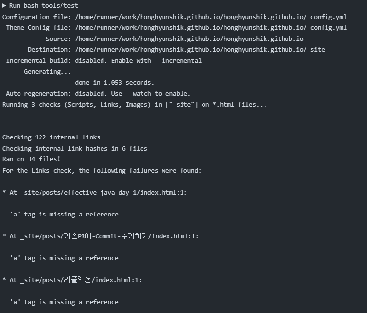
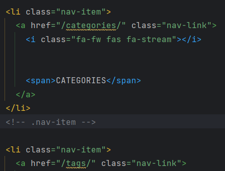

Github blog에 post를 배포하는 과정에서 build 오류가 발생했다. 

오류 내용을 보면, 각 글의 index.html에 a tag의 링크가 맞지 않다라는 뜻인 것 같다.

index.html의 a tag에는 절대경로로 categories, tags 등의 dir을 가리키고 있는데 이에 해당하는 dir가 없었다.
일단 categories, tags 등 빈 dir을 만들어주었다. 
